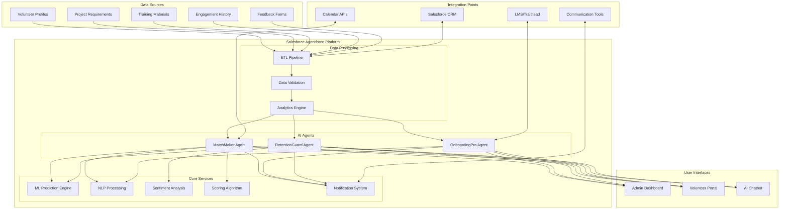
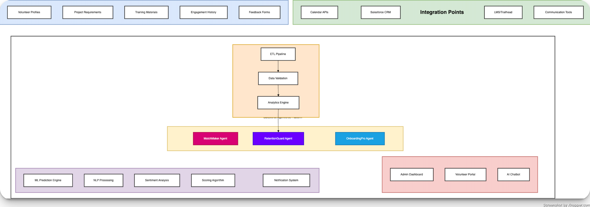

# Architecture



The architecture of the Salesforce Agentforce platform is designed to be modular and scalable. The platform consists of several key components that work together to deliver a seamless experience for volunteers and project managers. The data sources provide the necessary information for the AI agents to make intelligent decisions. The core services handle the heavy lifting of data processing and analysis, while the integration points allow the platform to interact with external systems. The user interfaces provide an intuitive way for users to interact with the platform and access the information they need. Overall, the architecture is designed to be flexible and adaptable to meet the needs of a wide range of organizations and use cases.
```

