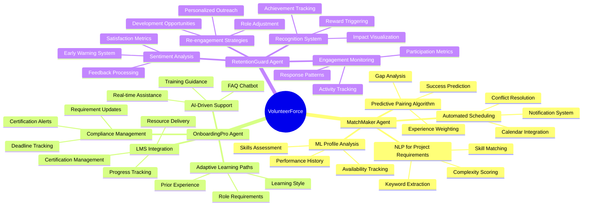

# Features

```mermaid
mindmap
  root((VolunteerForce))
    MatchMaker Agent
      ::icon(fa fa-puzzle-piece)
      ML Profile Analysis
        Skills Assessment
        Availability Tracking
        Performance History
      NLP for Project Requirements
        Complexity Scoring
        Keyword Extraction
        Skill Matching
      Predictive Pairing Algorithm
        Experience Weighting
        Success Prediction
        Gap Analysis
      Automated Scheduling
        Calendar Integration
        Notification System
        Conflict Resolution
    OnboardingPro Agent
      ::icon(fa fa-graduation-cap)
      Adaptive Learning Paths
        Role Requirements
        Prior Experience
        Learning Style
      LMS Integration
        Progress Tracking
        Certification Management
        Resource Delivery
      AI-Driven Support
        FAQ Chatbot
        Training Guidance
        Real-time Assistance
      Compliance Management
        Certification Alerts
        Deadline Tracking
        Requirement Updates
    RetentionGuard Agent
      ::icon(fa fa-heart)
      Engagement Monitoring
        Activity Tracking
        Participation Metrics
        Response Patterns
      Sentiment Analysis
        Feedback Processing
        Early Warning System
        Satisfaction Metrics
      Recognition System
        Achievement Tracking
        Reward Triggering
        Impact Visualization
      Re-engagement Strategies
        Personalized Outreach
        Role Adjustment
        Development Opportunities
```

