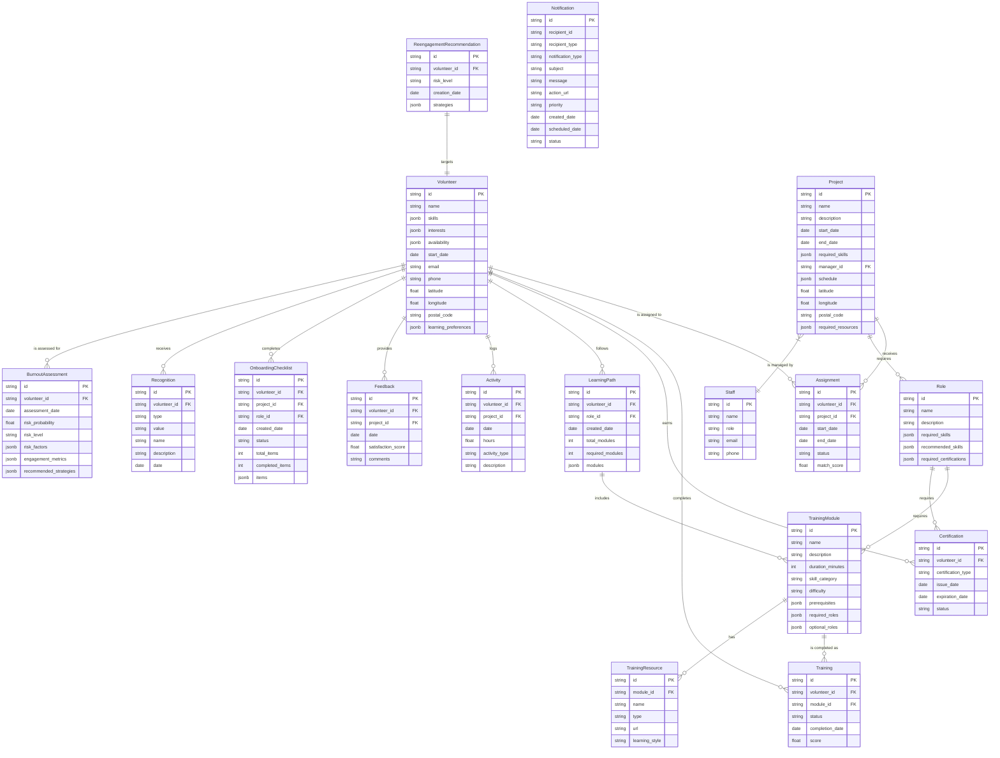

# Data Model

The data model is designed to support the three integrated AI agents of VolunteerForce: MatchMaker, OnboardingPro, and RetentionGuard. This comprehensive data structure enables efficient volunteer management throughout the entire lifecycle, from recruitment and matching to onboarding and retention.

## Data Model Overview

This data model addresses the three critical challenges identified in our business proposal:

1. **Inefficient Matching**: The Volunteer, Project, Role, and Assignment entities capture detailed information about skills, interests, availability, and project requirements to enable the MatchMaker Agent to create optimal volunteer-project pairings.

2. **Inconsistent Onboarding**: The TrainingModule, Training, LearningPath, Certification, and OnboardingChecklist entities support the OnboardingPro Agent in delivering personalized training paths and tracking progress.

3. **High Turnover**: The Activity, Feedback, Recognition, BurnoutAssessment, and ReengagementRecommendation entities provide the RetentionGuard Agent with the data needed to monitor engagement patterns, identify burnout risks, and implement retention strategies.

## Agent-Specific Data Support

### MatchMaker Agent
- **Volunteer**: Stores comprehensive profiles including skills, interests, availability, and location
- **Project**: Captures project requirements, schedules, and locations
- **Role**: Defines specific skill requirements for different positions
- **Assignment**: Records the match between volunteers and projects with a match score

### OnboardingPro Agent
- **TrainingModule**: Defines learning content with prerequisites and role requirements
- **Training**: Tracks volunteer progress through modules
- **LearningPath**: Creates personalized training sequences based on roles
- **Certification**: Records qualifications earned by volunteers
- **TrainingResource**: Provides diverse learning materials to accommodate different learning styles
- **OnboardingChecklist**: Ensures consistent onboarding processes across the organization

### RetentionGuard Agent
- **Activity**: Logs volunteer engagement and hours
- **Feedback**: Captures volunteer satisfaction and comments
- **Recognition**: Records achievements and appreciation
- **BurnoutAssessment**: Evaluates volunteer burnout risk with predictive analytics
- **ReengagementRecommendation**: Suggests personalized strategies to re-engage at-risk volunteers

### Supporting Entities
- **Staff**: Manages projects and volunteers
- **Notification**: Facilitates communication across the platform

This data model is designed to be implemented on Salesforce's Agentforce platform, leveraging its powerful CRM capabilities and AI integration to transform volunteer management for nonprofit organizations.

